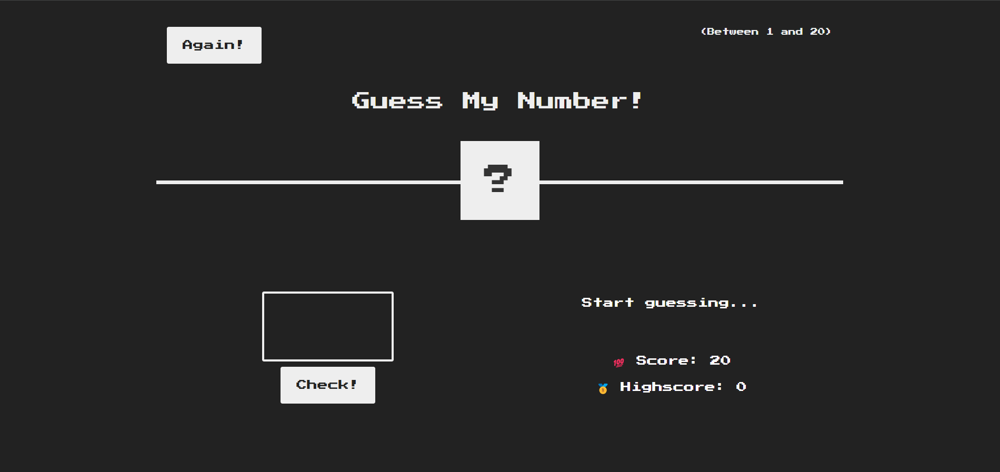
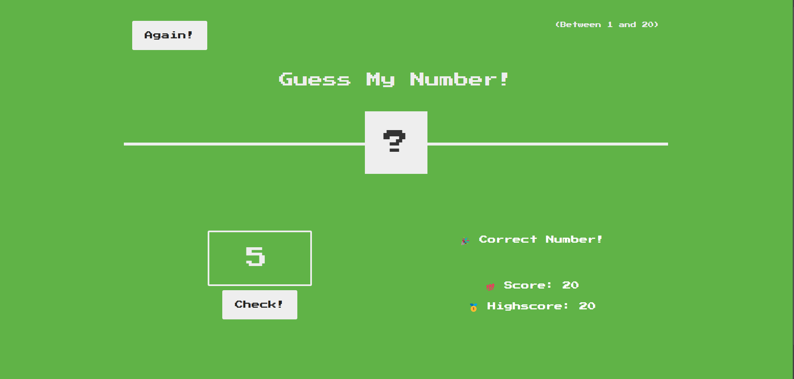
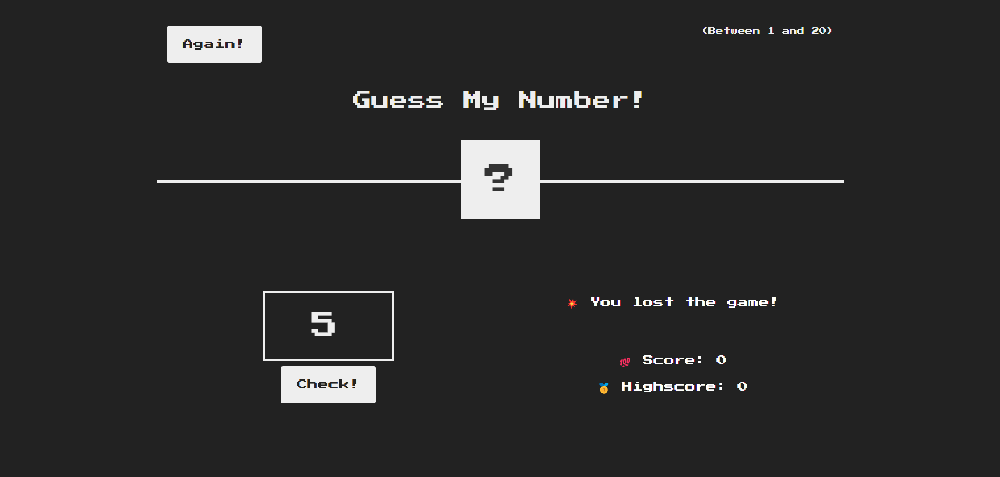

# Guess My Number Game 🎲

## Project Description

"Guess My Number" is a simple and interactive number-guessing game implemented using React. The player tries to guess a randomly generated number between 1 and 20. The game provides feedback whether the guessed number is too high, too low, or correct. The player wins if they guess the correct number, and the score is tracked to set a high score.

## Features

- Random number generation between 1 and 20.
- User input for guessing the number.
- Feedback on whether the guess is too high, too low, or correct.
- Score tracking to encourage multiple plays.
- High score tracking to record the best performance.
- Reset functionality to start a new game.

## Technologies Used

- **React**: For building the user interface.
- **CSS (Bootstrap and custom)**: For styling the application.
- **JavaScript**: For handling game logic.

## Project Structure

- `src/components/Guess.js`: The main React functional component includes the game logic and UI elements.
- `src/styles/Guess.css`: The external CSS file styling the game, including layout, colors, and fonts.

## Installation and Setup

1. Clone the repository:
   ```bash
   git clone https://github.com/yourusername/guess-my-number-game.git
   ```
2. Navigate to the project directory:
   ```bash
   cd guess-my-number-game
   ```
3. Install the dependencies:
   ```bash
   npm install
   ```
4. Start the development server:
   ```bash
   npm start
   ```
5. Open your browser and go to `http://localhost:3000` to play the game.

## How to Play

1. Guess a number between 1 and 20 by entering it in the input field.
2. Click the "Check!" button to submit your guess.
3. The game will provide feedback:
   - If your guess is too high or too low.
   - If your guess is correct.
4. Keep guessing until you find the correct number or your score reaches zero.
5. Click the "Again!" button to reset the game and play again.
6. Try to set a new high score by guessing correctly with the fewest attempts.

## Screenshots






## Acknowledgments

- Inspired by the "Guess My Number" game built using vanilla JavaScript.
- Font used: "Press Start 2P" from Google Fonts.
